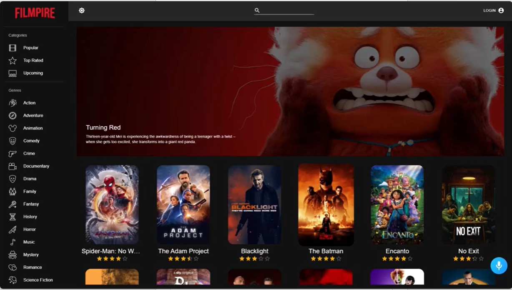

<a name="readme-top"></a>

<div align="center">

 <!-- LOGO -->

  
  <br/>

<!-- MAIN HEADING -->

  <h3><b>Filmpire</b></h3>

</div>

<!-- TABLE OF CONTENTS -->
# 📗 Table of Contents

- [📖 About the Project](#about-project)
  - [🛠 Built With](#built-with)
    - [Tech Stack](#tech-stack)
    - [Key Features](#key-features)
- [🚀 Live Demo](#live-demo)
- [💻 Getting Started](#getting-started)
  - [Setup](#setup)
  - [Prerequisites](#prerequisites)
  - [Install](#install)
  - [Usage](#usage)
  - [Run tests](#run-tests)
  - [Deployment](#deployment)
- [👥 Authors](#authors)
- [🔭 Future Features](#future-features)
- [🤝 Contributing](#contributing)
- [⭐️ Show your support](#support)
- [🙏 Acknowledgements](#acknowledgements)
- [❓ FAQ (OPTIONAL)](#faq)
- [📝 License](#license)

<!-- INTRO -->
# 📖 Filmpire<a name="about-project"></a>

> Filmpire is a Movie collection app developed that allows users to search for a wide variety of movies, ranging from action, to comedy, drama, adventure, and all genre of movies. Users have the ability to favorite movies and add them to a watchlist. Users could also watch movie trailers. The entire movie collection is powered by the TMDB API.
>
> The entire movie collection is powered by the TMDB API.

## 🛠 Built With <a name="built-with"></a>
1. React
2. Materials UI
3. AMDB API
4. Redux Toolkit

### Tech Stack <a name="tech-stack"></a>

<details>
  <summary>Client</summary>
  <ul>
    <li><a href="https://reactjs.org/">React</a></li>
    <li><a href="https://mui.com/">Materials UI</a></li>
    <li><a href="https://developer.themoviedb.org/docs/getting-started">AMDB API</a></li>
    <li><a href="https://redux-toolkit.js.org/">Redux Toolkit</a></li>
  </ul>
</details>

<!-- Features -->

### Key Features <a name="key-features"></a>

> - View Movies by Genre
> - View Movies by Categories
> - Search for Movies by Titles
> - Add Movies to favorites list
> - Add Movies to watchlist
> - View Movie Details
> - View Movie Trailers
> - Switch between Light and Dark modes

<p align="right">(<a href="#readme-top">back to top</a>)</p>

<!-- LIVE DEMO -->

LIVE DEMO

> View the [live](https://live-docs-encarta.vercel.app) page of the project here.

<p align="right">(<a href="#readme-top">back to top</a>)</p>

<!-- GETTING STARTED -->

## 💻 Getting Started <a name="getting-started"></a>

> To get a local copy of the project, use this link:
> 
```sh
cd filmpire
https://github.com/anyars-encarta/filmpire.git
```

<!-- SETUP -->
### Setup

To setup this project, run this command:

```sh
npm install
```
### Prerequisites

1. A Browser (Preferably Google Chrome)
2. A Code Editor
3. Internet Connection
4. Git

<!-- INSTALL -->
### Install

Install this project with Iroko.

### Usage

To run the project, execute the following command:

```sh
npm start
```

### Run tests
To test the project, execute the following command:
```sh
npm start
```
### Deployment

You can deploy this project using:
> 1. GitHub Pages
> 2. Vercel
> 3. Netlify
> 4. Any other hosting site

<p align="right">(<a href="#readme-top">back to top</a>)</p>

<!-- AUTHORS -->
## 👥 Authors <a name="authors"></a>

👤 **Anyars Yussif**

- GitHub: [@anyars-encarta](https://github.com/anyars-encarta)
- Twitter: [@anyarsencarta](https://twitter.com/anyarsencarta)
- LinkedIn: [LinkedIn](https://www.linkedin.com/in/anyars-yussif/)


<p align="right">(<a href="#readme-top">back to top</a>)</p>

## 🔭 Future Features <a name="future-features"></a>

- [ ] **Movie Downloads**
- [ ] **Movie Rating**
- [ ] **Add Comments**

<p align="right">(<a href="#readme-top">back to top</a>)</p>

<!-- CONTRIBUTION -->
## 🤝 Contributing <a name="contributing"></a>

Contributions, issues, and feature requests are welcome!

<p align="right">(<a href="#readme-top">back to top</a>)</p>

<!--SUPPORT -->

## ⭐️ Show your support <a name="support"></a>

> If you like this project, please give it some starts ⭐️⭐️⭐️⭐️⭐️

<p align="right">(<a href="#readme-top">back to top</a>)</p>

<!-- ACKNOWLEDGEMENTS -->
## 🙏 Acknowledgments <a name="acknowledgements"></a>

> Special credit to [adrianhajdin](https://github.com/adrianhajdin) and [microverseinc](https://github.com/microverseinc) for the linters conguration and materials.

<p align="right">(<a href="#readme-top">back to top</a>)</p>

<!-- FAQS -->
## ❓ FAQ (OPTIONAL) <a name="faq"></a>

- **How were the React and Linters utilised?**

  - The React and Linters were utilised with the help of resources provided by [@microverseinc](https://github.com/microverseinc).

- **What new features should be expected in the next release of the project?**

  - I am currently working on Movie Downloads, rating Movies, and Adding Comments to Movies.

<p align="right">(<a href="#readme-top">back to top</a>)</p>

<!-- LICENSE -->

## 📝 License <a name="license"></a>

This project is protected and is not allowed for use without persmission.

<p align="right">(<a href="#readme-top">back to top</a>)</p>
